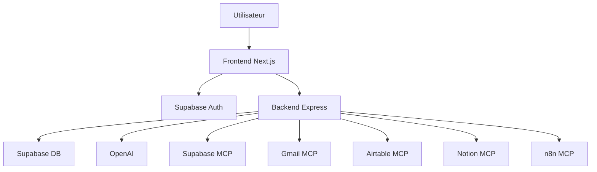

# 02 - Architecture globale

## Vue d'ensemble

Le projet est organise comme un monorepo avec deux applications principales :

- un `frontend` en `Next.js`
- un `backend` en `Express`

Le frontend affiche l'interface et gere la session utilisateur cote web. Le backend centralise ensuite la logique metier, les integrations, le chat IA, les validations et les connexions aux services externes.

## Principe architectural

Le backend est la couche d'orchestration principale.

Cela veut dire que :

- le frontend reste simple et consomme une API claire
- l'authentification applicative passe par `Supabase`
- les appels vers `Gmail`, `Notion`, `Airtable`, `n8n` ou `Supabase MCP` sont pilotes par le backend
- l'IA dialogue avec le backend, qui decide ensuite quelles integrations appeler

## Schema simplifie

## Pourquoi ce choix d'architecture

Ce choix permet de garder plusieurs avantages :

- une interface frontend plus legere
- une meilleure maitrise de la securite et des secrets
- un point unique pour valider les donnees et gerer les erreurs
- une integration plus propre des flux OAuth et MCP
- une meilleure evolutivite si l'on ajoute de nouvelles integrations

## Couches principales

### Frontend

Le frontend est responsable de :

- l'affichage
- la navigation
- la recuperation de la session utilisateur
- l'envoi du JWT vers le backend
- les redirections utilisateur, notamment une partie du flux Gmail

Fichiers de reference :

- `frontend/src/app/`
- `frontend/src/lib/api.ts`
- `frontend/src/lib/supabase/`

### Backend

Le backend est responsable de :

- l'API HTTP
- la validation des requetes
- le middleware d'authentification
- les appels aux integrations
- la logique du chat IA
- les health checks et les smoke tests

Fichiers de reference :

- `backend/src/index.ts`
- `backend/src/routes/`
- `backend/src/services/`
- `backend/src/validators/schemas.ts`

### Supabase

`Supabase` joue deux roles :

- auth applicative
- base de donnees principale

Il sert aussi de support a certaines operations MCP, selon la configuration du projet.

### MCP

Le projet utilise MCP comme protocole de connexion a des outils externes. Dans cette architecture :

- le backend est client MCP
- il n'y a pas de serveur MCP interne dans le repo
- chaque integration possede sa logique de configuration et son mode d'acces

## Flux principal de l'IA

1. L'utilisateur saisit une intention dans l'interface.
2. Le frontend envoie la requete au backend.
3. Le backend prepare le contexte, la conversation et les outils disponibles.
4. Le modele peut appeler des outils metier ou MCP.
5. Le backend execute l'action autorisee.
6. Le resultat revient a l'interface sous forme de reponse utile.

## Contraintes a ne pas casser

Si l'architecture evolue, ces principes doivent rester vrais :

- le backend reste la couche centrale
- les secrets et appels sensibles ne remontent pas dans le frontend
- l'IA ne devient pas une fonctionnalite annexe
- les integrations MCP restent compatibles avec le projet
- la documentation suit les changements d'architecture
