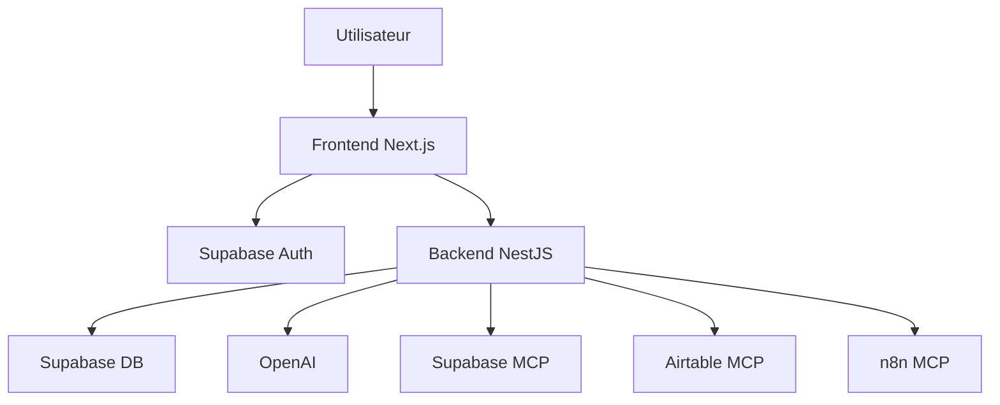

# 02 — Architecture globale

## Vue d’ensemble

Le dépôt est un **monorepo** : une application **Next.js** (`frontend/`) et une API **NestJS** (`backend-nest/`). Le navigateur affiche l’interface et la session ; l’API concentre la logique métier, le chat IA, les appels aux outils externes et les validations.

## Rôle de chaque couche

Le **backend NestJS** est le **point central** : le front reste léger et parle à une API HTTP claire. L’**authentification** des utilisateurs passe par **Supabase**. Les connexions **Airtable**, **n8n** et **Supabase MCP** sont pilotées par le serveur, pas improvisées dans le navigateur. Le **modèle de langage** utilisé pour l’assistant dialogue avec ce même backend, qui décide quels outils peuvent être appelés.

## Schéma simplifié

## Pourquoi séparer front et API ?

- Les **secrets** (clés IA, tokens serveur) restent côté serveur.
- Un seul endroit pour **valider** les entrées et **gérer les erreurs**.
- Le front peut **changer** d’aspect sans casser les règles métier.
- Les **secrets** (jetons MCP, clés serveur) et les appels **MCP** restent **côté serveur**, plus simples à suivre et à auditer.

## Frontend : responsabilités

Affichage, **navigation** (dock bas en bulles, barre de recherche pages, layout `/app` — voir [`07-frontend.md`](07-frontend.md)), récupération de la session, envoi du **JWT** vers l’API. Fichiers utiles : `frontend/src/app/`, `frontend/src/lib/api.ts`, `frontend/src/lib/supabase/`.

## Backend : responsabilités

Routes HTTP, contrôle du JWT, **clients MCP**, **chat**, **health checks**. Fichiers utiles : `backend-nest/src/main.ts`, `backend-nest/src/app.module.ts`, `backend-nest/src/chat/`, `backend-nest/src/health/`, `backend-nest/src/mcp/`.

## Supabase

Deux usages principaux : **Auth** pour les comptes, **base PostgreSQL** pour les données applicatives. Selon la config, certaines opérations passent aussi par le **MCP Supabase**.

## MCP (Model Context Protocol)

Protocole qui **standardise** la façon dont le backend parle à des **serveurs MCP externes** (un par famille d’outil, en général). Le dépôt ne contient pas un « gros serveur MCP maison » : il contient **des clients** qui savent appeler ces serveurs, avec les bons jetons et la bonne config.

## Flux typique d’une interaction avec l’assistant

1. L’utilisateur envoie un message depuis l’interface.  
2. Le front transmet la requête à l’API avec le JWT.  
3. L’API prépare le contexte (historique, outils disponibles).  
4. Le modèle peut demander l’exécution d’un outil (MCP ou logique métier).  
5. L’API exécute ce qui est autorisé et renvoie le résultat au front.

## Principes à ne pas casser

Si le projet bouge, il vaut mieux garder : **un seul endroit** pour les secrets et les appels sensibles, **le backend** comme autorité, et **l’IA** comme partie intégrante du produit — pas comme une option cachée.
